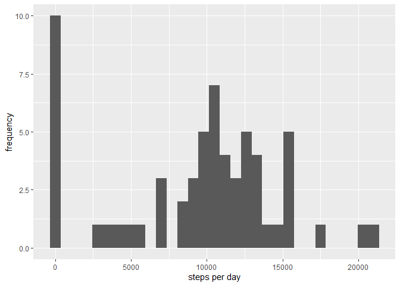
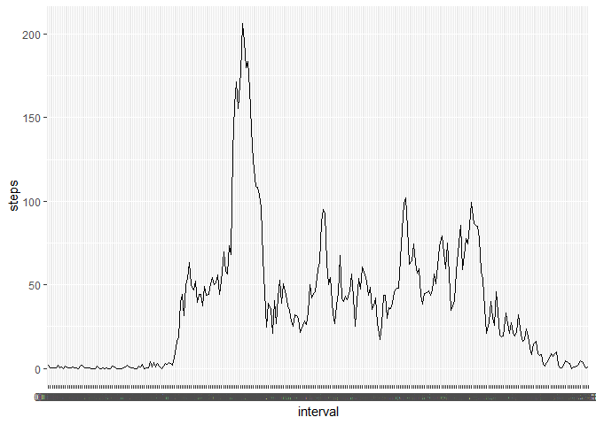
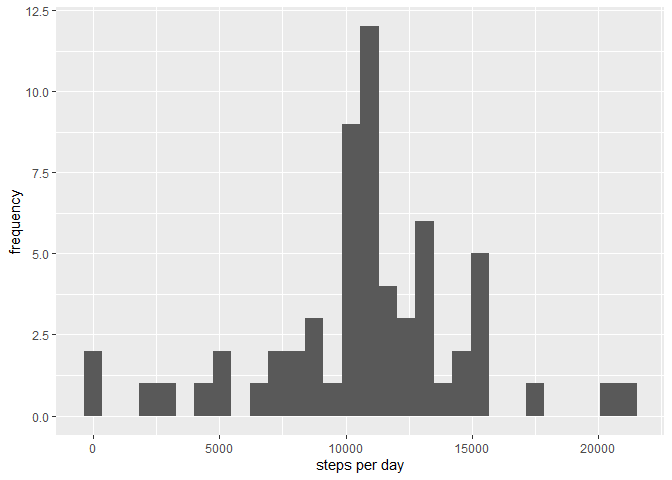
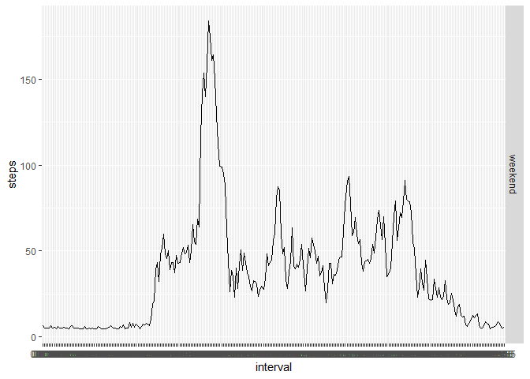

    library(knitr)
    opts_chunk$set(echo=TRUE)

## Loading and preprocessing the data

    library(ggplot2)

    ## Warning: package 'ggplot2' was built under R version 4.4.2

    library(dplyr)

    ## Warning: package 'dplyr' was built under R version 4.4.2

**Load the data**

    activity <- read.csv('C:/Users/Боби/Desktop/activity.csv')

**Process/transform the data (if necessary) into a format suitable for
your analysis**

    activity <- read.csv('C:/Users/Боби/Desktop/activity.csv')
    str(activity)

    ## 'data.frame':    17568 obs. of  3 variables:
    ##  $ steps   : int  NA NA NA NA NA NA NA NA NA NA ...
    ##  $ date    : chr  "2012-10-01" "2012-10-01" "2012-10-01" "2012-10-01" ...
    ##  $ interval: int  0 5 10 15 20 25 30 35 40 45 ...

    activity$date <- as.Date(activity$date, '%Y-%m-%d')
    activity$interval <- sprintf("%04d", activity$interval)
    activity$interval <- format(strptime(activity$interval, format="%H%M"), format = "%H:%M")

## What is mean total number of steps taken per day?

------------------------------------------------------------------------

**Calculate the total number of steps taken per day**

    daysteps <- tapply(activity$steps, activity$date, sum, na.rm=T)

**Make a histogram of the total number of steps taken each day**

    daysteps %>% qplot(xlab='steps per day', ylab='frequency', binwidth=700)

    ## Warning: `qplot()` was deprecated in ggplot2 3.4.0.
    ## This warning is displayed once every 8 hours.
    ## Call `lifecycle::last_lifecycle_warnings()` to see where this warning was
    ## generated.

**Calculate and report the mean and median of the total number of steps
taken per day**

    meanvalue <- mean(daysteps)
    medianvalue <- median(daysteps)

Mean: 9354.2295082, Median:10395

## What is the average daily activity pattern?

------------------------------------------------------------------------

**Make a time series plot of the 5-minute interval (x-axis) and the
average number of steps taken, averaged across all days (y-axis)**

    average_steps <- activity %>% filter(!is.na(steps)) %>% group_by(interval) %>% 
            summarize(steps = mean(steps))
    average_steps %>% ggplot(aes(x=interval, y=steps, group=1)) + geom_line()

**Which 5-minute interval, on average across all the days in the
dataset, contains the maximum number of steps?**

    max_steps <- average_steps[which.max(average_steps$steps), ][[1]]

The interval 08:35 has the maximum steps

## Imputing missing values

------------------------------------------------------------------------

**Calculate and report the total number of missing values in the
dataset**

    miss <- sapply(activity, is.na) %>% sum

Number of missing values: 2304

**Devise a strategy for filling in all of the missing values in the
dataset. The strategy does not need to be sophisticated. For example,
you could use the mean/median for that day, or the mean for that
5-minute interval, etc.**

We’ll fill in the missing values with the `steps` mean

**Create a new dataset that is equal to the original dataset but with
the missing data filled in.**

    steps_complete <- activity$steps
    steps_complete[is.na(steps_complete)] <- round(mean(activity$steps, na.rm = T), digits=0)
    steps_complete <- as.numeric(steps_complete)
    activity_complete <- cbind.data.frame(steps_complete, activity$date, activity$interval)
    colnames(activity_complete) <- colnames(activity)

**Make a histogram of the total number of steps taken each day**

    daysteps_complete <- tapply(activity_complete$steps, activity_complete$date, sum)
    daysteps_complete %>% qplot(xlab='steps per day', ylab='frequency')

**Calculate and report the mean and median total number of steps taken
per day. Do these values differ from the estimates from the first part
of the assignment? What is the impact of imputing missing data on the
estimates of the total daily number of steps?**

    mean_complete <- mean(daysteps_complete)
    median_complete <- median(daysteps_complete)

Mean: 1.0751738^{4}, Median: 1.0656^{4}

The mean and median values differ from those which were calculated with
`NAs`. The values became greater

## Are there differences in activity patterns between weekdays and weekends?

------------------------------------------------------------------------

**Create a new factor variable in the dataset with two levels -
“weekday” and “weekend” indicating whether a given date is a weekday or
weekend day.**

    activity_complete$date <- as.Date(activity_complete$date)
    weekd <-c('Monday', 'Tuesday', 'Wednesday', 'Thursday', 'Friday')
    activity_complete$weekdayz <- factor((weekdays(activity_complete$date) %in% weekd),
                                         levels = c(FALSE, TRUE), labels = c('weekend', 'weekday'))

**Make a panel plot containing a time series plot of the 5-minute
interval (x-axis) and the average number of steps taken, averaged across
all weekday days or weekend days (y-axis).**

    average_steps_complete <- activity_complete %>% group_by(interval, weekdayz) %>%
            summarise(steps = mean(steps))

    ## `summarise()` has grouped output by 'interval'. You can override using the
    ## `.groups` argument.

    average_steps_complete %>% ggplot(aes(x=interval, y=steps, group=1)) +
            geom_line() + 
            facet_grid(weekdayz~.)

